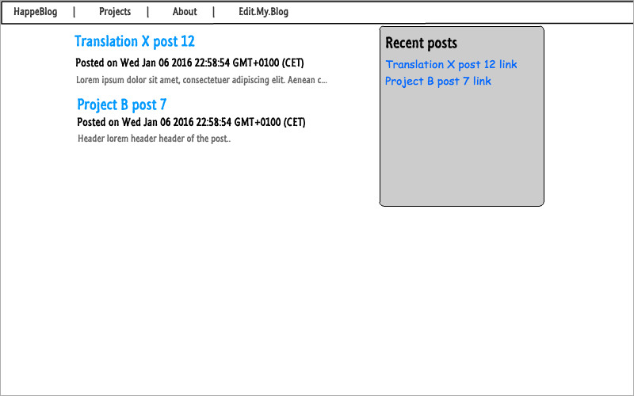
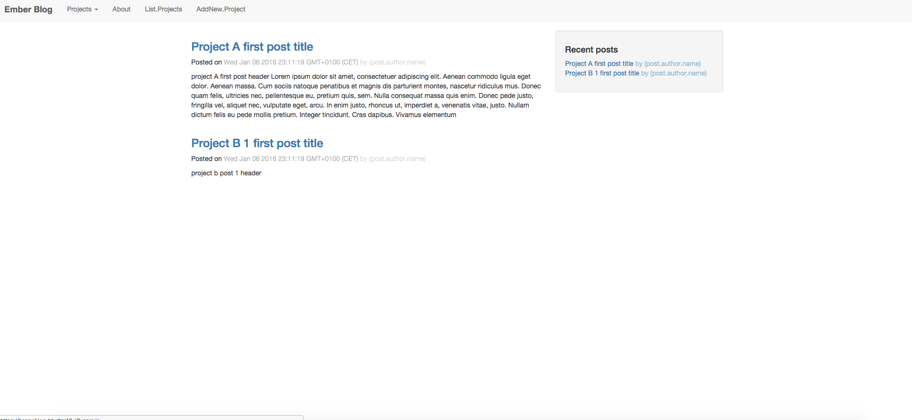
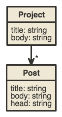
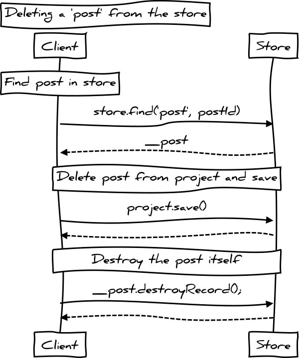

# Alkalmazások fejlesztése gyakorlat

# Happeblog - Harmadik beadandó feladat

**Csoport:** AF 6. csoport 
**Neptun:** DF2KIE

Feladat témája: 
Blog oldal, ahol több kategóriát feltölthetünk leírással. 
Kategória létrehozása után feltölthetünk post-okat a kategóriákba.
Ezeket a bejegyzéseket lehet szerkeszteni, törölni.
Bejegyzések megjelennek a főoldalon egymás után sorba.

[GitHub link] (https://github.com/zeronero13/happeblog)

## Követelményanalízis

### Követelmények összegyűjtése
Követelmények összegyűjtése a nyújtandó szolgáltatások ismertetése rövid, szöveges leírásként.

1. Funkcionális elvárások

    * Vendég képes legyen a blogon közzétett kategóriákat, és hozzájuk feltöltött bejegyzéseket megnézni, böngészni.
    * Felhasználó képes legyen blogot szerkeszteni, új kategóriákat (projekteket) létrehozni, szerkeszteni. Feltölteni új post-okat, szerkeszteni, törölni őket.

### Használatieset-modell
+ Szerepkörök: lista rövid leírással

    * Vendég képes legyen a blogon közzétett kategóriákat, és hozzájuk feltöltött bejegyzéseket megnézni, böngészni.
    * Felhasználó képes legyen blogot szerkeszteni, új kategóriákat (projekteket) létrehozni, szerkeszteni. Feltölteni új post-okat, szerkeszteni, törölni őket.
    
#### Szerepkörök: rövid leírással

**Felhasználó:**
Kategóriák leírását megnézni.
Kategóriákhoz feltöltött megjegyzéseket megnézni.
Új kategóriákat létrehozni (projektek)
Kategóriákon belül új bejegyzéseket létrehozni, szerkeszteni, törölni.

#### Használati eset diagramok

#### Folyamatok menete

## Tervezés

### Architektúra terv

- Oldaltérkép
    
    **Publikus:**
    - Főoldal
    - Böngészés oldalon
    - Kategória létrehozástor
    - Új bejegyzés felvétele kategróiákba
    - Bejegyzések szerkesztése, törlése

- Végpontok

    + / :Főoldal
    + /about :Oldalról információ
    + /posts/post/:post_id :Bejegyzés megtekintése
    + /posts/new/:projectid :Új bejegyzés adott projektbe
    + /projects/list/ :Projektek felsorolása
    + /projects/project/:id :Projekt megtekintése
    + /projects/new/ :Új projekt felvétele
        
### Felhasználóifelület-modell 

- Oldalvázlatok
    * Mockup index oldalról (public/doc/index_mockup.jpg)

- Designterv (végső megvalósítás kinézete)
    
    * Megvalósítás index oldal (public/doc/design.png)

### + Osztálymodell
    - Adatmodell, Adatbázisterv
    
    * Adatbázisterv (public/doc/database.png)

    
### Dinamikus működés

- Szekvenciadiagram
    * Egy 'post' törlése sikeresen (public/doc/seq_deleting_post_from_store.jpg)

## Implementáció

### Fejlesztőeszközök

Fejlesztőeszközök: C9

Kódtár, verzió kontrol: Github

Fejlszetés technológiák: Javascript, Node.js, Ember, Ember Inpector plugin (Firefox)

Modulok:
    * Ember-cli
    * Express, 
    * Babel, Babel-preset-es 2015
    * Fortune
    * Bower
    * Bootstrap, Bootswatch
    * Moment

### Könyvtárstruktúra

Projekt felesztése során nem lettek használva pods.

**./app/adapters**
Kapcsolat beállítása adatbázishoz.
**./app/components**
Komponensek .js fájl
**./app/controllers**
Kontrollerek a routokhoz.
**./app/helpers**
Handlebarshoz plusz helperekkel kiegészítés.
**./app/models**
Adattár, fejlesztéshez használva fixture adapterrel. Végső verzióban nem használva.
**./app/routes**
Routokhoz .js fájlok
**./app/styles**
Oldalon használt stíluslapok .css
**./app/templates**
Sablonok .hbs fájlok

## Tesztelés
-
### Tesztelés (Running Tests)

* `ember test`
* `ember test --server`

### Egység tesztelés
-
### Funkciónális teszt
-
## Felhasználói dokumentáció

### Szükséges előfeltételek (Prerequisites)
You will need the following things properly installed on your computer.

**Webes vastagkliens**
* [Git](http://git-scm.com/)
* [Node.js](http://nodejs.org/) (with NPM)
* [Bower](http://bower.io/)
* [Ember CLI](http://www.ember-cli.com/)
* [PhantomJS](http://phantomjs.org/)

**Database**
* Happeblog-api app. által, Fortune,fortune-nedb,fortune-json-api segítségével (szerveroldali perzisztálás fájlba)

### Telepítés (Installation)

* `git clone <repository-url>` this repository
* change into the new directory
* `npm install`
* `bower install`

### Futtatás (Running / Development) 

* `ember server`
* Visit your app at [http://localhost:4200](http://localhost:4200).

### Tesztelés (Running Tests)

* `ember test`
* `ember test --server`

### Building

* `ember build` (development)
* `ember build --environment production` (production)

## Further Reading / Useful Links

* [ember.js](http://emberjs.com/)
* [ember-cli](http://www.ember-cli.com/)
* Development Browser Extensions
  * [ember inspector for chrome](https://chrome.google.com/webstore/detail/ember-inspector/bmdblncegkenkacieihfhpjfppoconhi)
  * [ember inspector for firefox](https://addons.mozilla.org/en-US/firefox/addon/ember-inspector/)

* [Kapcsolatok adatok között](http://baruch.lubinsky.co.za/post/2014/08/beerdemo/)
* [Ember route pédák](https://github.com/suchitpuri/emberjs-essentials/blob/master/chapter-6/example1/app/routes/books/new.js)
* [Egyéb](http://www.iteye.com/news/30894)
